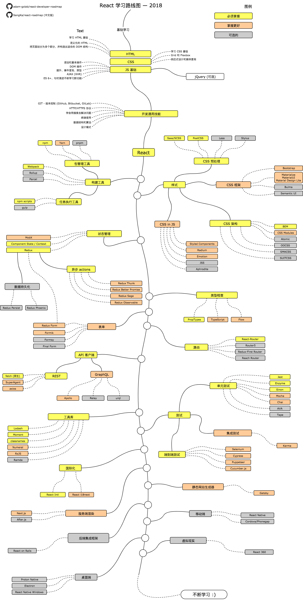

# React 学习路线图

> 此学习路线将指引你在 2018 年成为 React 开发者

下面的思维导图展示了 React 的学习路线以及在学习道路上所需要学习的东西。我画此图的目的主要是为了让问我“我接下来要学什么才能成为 React 开发者？”的人有一个清晰的目标。

## 免责声明

> 此学习路线图的目的是为了 React 整体生态有个概念。如果你对于接下来要学习什么感到困惑的话，它将指引你，但并不会鼓励你去盲目地追从一些时髦和新潮的技术。你应该理解为什么某个工具在某些情况下比另一个更加适合，记住时髦和新潮的技术并不总是最适合用于工作当中

## 学习路线图

## 资源

1. 基础
    1. HTML
        * 学习 HTML 基础
        * 写些页面作为练习
    2. CSS
        * 学习 CSS 基础
        * 在上一步练习的基础上为页面添加样式
        * 使用 grid 和 flexbox 为页面布局
    3. JS 基础
        * 熟悉语法
        * 学习 DOM 的基础操作
        * 学习 JS 中的经典机制 (提升、事件冒泡、原型)
        * 发起一些 AJAX (XHR) 请求
        * 学习新功能 (ES 6+)
        * 此外，熟悉下 jQuery 库
2. 开发通用技能
    1. 学习 GIT ，在 GitHub 上创建一些仓库，并与其他人分享你的代码
    2. 了解 HTTP(S) 协议，请求方法 (GET, POST, PUT, PATCH, DELETE, OPTIONS)
    3. 别害怕使用 Google [Google 的强力搜索](http://www.powersearchingwithgoogle.com/)
    4. 熟悉终端，配置 shell (bash、zsh、fish)
    5. 读一些数据结构和算法的书
    6. 读一些设计模式的书
3. 在[官方网站](https://reactjs.org/tutorial/tutorial.html)上学习 React ，或者看一些[教程](https://egghead.io/courses/the-beginner-s-guide-to-react)
4. 熟悉一些将会用到的工具
    1. 包管理工具
        * [npm](https://www.npmjs.com/)
        * [yarn](https://yarnpkg.com/lang/en/)
        * [pnpm](https://pnpm.js.org/)
    2. 任务执行工具
        * [npm scripts](https://docs.npmjs.com/misc/scripts)
        * [gulp](https://gulpjs.com/)
    * [Webpack](https://webpack.js.org/)
    * [Rollup](https://rollupjs.org/guide/en)
    * [Parcel](https://parceljs.org/)
5. 样式
    1. CSS 预处理
        * [Sass/CSS](https://sass-lang.com/)
        * [PostCSS](https://postcss.org/)
        * [Less](http://lesscss.org/)
        * [Stylus](http://stylus-lang.com/)
    2. CSS 框架
        * [Bootstrap](https://getbootstrap.com/)
        * [Materialize](https://materializecss.com/)、[Material UI](https://material-ui.com/)、[Material Design Lite](https://getmdl.io/)
        * [Bulma](https://bulma.io/)
        * [Semantic UI](https://semantic-ui.com/)
    3. CSS 架构
        * [BEM](http://getbem.com/)
        * [CSS Modules](https://github.com/css-modules/css-modules)
        * [Atomic](https://acss.io/)
        * [OOCSS](https://github.com/stubbornella/oocss/wiki)
        * [SMACSS](https://smacss.com/)
        * [SUITCSS](https://suitcss.github.io/)
    4. CSS in JS
        * [Styled Components](https://www.styled-components.com/)
        * [Radium](https://formidable.com/open-source/radium/)
        * [Emotion](https://emotion.sh/)
        * [JSS](http://cssinjs.org/)
        * [Aphrodite](https://github.com/Khan/aphrodite)
6. 状态管理
    1. [Component State](https://reactjs.org/docs/faq-state.html)/[Context API](https://reactjs.org/docs/context.html)
    2. [Redux](https://redux.js.org/)
        1. 异步 actions (副作用)
            * [Redux Thunk](https://github.com/reduxjs/redux-thunk)
            * [Redux Better Promise](https://github.com/Lukasz-pluszczewski/redux-better-promise)
            * [Redux Saga](https://redux-saga.js.org/)
            * [Redux Observable](https://redux-observable.js.org)
        2. 数据持久化
            * [Redux Persist](https://github.com/rt2zz/redux-persist)
            * [Redux Phoenix](https://github.com/adam-golab/redux-phoenix)
        3. [Redux Form](https://redux-form.com)
    3. [MobX](https://mobx.js.org/)
7. 类型检查
    * [PropTypes](https://reactjs.org/docs/typechecking-with-proptypes.html)
    * [TypeScript](https://www.typescriptlang.org/)
    * [Flow](https://flow.org/en/)
8. 表单
    * [Redux Form](https://redux-form.com)
    * [Formik](https://github.com/jaredpalmer/formik)
    * [Formsy](https://github.com/formsy/formsy-react)
    * [Final Form](https://github.com/final-form/final-form)
9. 路由
    * [React-Router](https://reacttraining.com/react-router/)
    * [Router5](https://router5.js.org/)
    * [Redux-First Router](https://github.com/faceyspacey/redux-first-router)
    * [Reach Router](https://reach.tech/router/)
10. API 客户端
    1. REST
        * [Fetch](https://developer.mozilla.org/en-US/docs/Web/API/Fetch_API)
        * [SuperAgent](https://visionmedia.github.io/superagent/)
        * [axios](https://github.com/axios/axios)
    2. GraphQL
        * [Apollo](https://www.apollographql.com/docs/react/)
        * [Relay](https://facebook.github.io/relay/)
        * [urql](https://github.com/FormidableLabs/urql)
11. 工具库
    * [Lodash](https://lodash.com/)
    * [Moment](https://momentjs.com/)
    * [classnames](https://github.com/JedWatson/classnames)
    * [Numeral](http://numeraljs.com/)
    * [RxJS](http://reactivex.io/)
    * [Ramda](https://ramdajs.com/)
12. 测试
    1. 单元测试
        * [Jest](https://facebook.github.io/jest/)
        * [Enzyme](http://airbnb.io/enzyme/)
        * [Sinon](http://sinonjs.org/)
        * [Mocha](https://mochajs.org/)
        * [Chai](http://www.chaijs.com/)
        * [AVA](https://github.com/avajs/ava)
        * [Tape](https://github.com/substack/tape)
    2. 端到端测试
        * [Selenium](https://www.seleniumhq.org/), [Webdriver](http://webdriver.io/)
        * [Cypress](https://cypress.io/)
        * [Puppeteer](https://pptr.dev/)
        * [Cucumber.js](https://github.com/cucumber/cucumber-js)
    3. 集成测试
        * [Karma](https://karma-runner.github.io/)
13. 国际化
    * [React Intl](https://github.com/yahoo/react-intl)
    * [React i18next](https://react.i18next.com/)
14. 服务端渲染
    * [Next.js](https://nextjs.org/)
    * [After.js](https://github.com/jaredpalmer/after.js)
15. 静态网站生成器
    * [Gatsby](https://www.gatsbyjs.org/)
16. 后端集成框架
    * [React on Rails](https://shakacode.gitbooks.io/react-on-rails/content/)
17. 移动端
    * [React Native](https://facebook.github.io/react-native/)
    * [Cordova](https://cordova.apache.org/)/[Phonegap](https://phonegap.com/)
18. 桌面端
    * [Proton Native](https://proton-native.js.org/)
    * [Electron](https://electronjs.org/)
    * [React Native Windows](https://github.com/Microsoft/react-native-windows)
19. 虚拟现实
    * [React 360](https://facebook.github.io/react-360/)

## 总结

如果你认为此学习路线图还有改进之处，请提 PR 或 issues 。还有，我会持续进行补充与完善，所以你可能会想要给我个 star 以便于以后浏览。

## 参与贡献

学习路线图是使用 [Draw.io](https://www.draw.io/) 画的。文件就放在 `/src` 目录下。想要修改思维导图，先打开 draw.io ，点击 **Open Existing Diagram** 然后选择 `xml` 文件。之后就会打开思维导图，修改之后上传后更新 README 的 PNG 图片 (需要导出)，然后提交 PR 。

- 提交 PR 以帮助改进
- 在 issues 中进行讨论想法
- 帮忙宣传

## License

